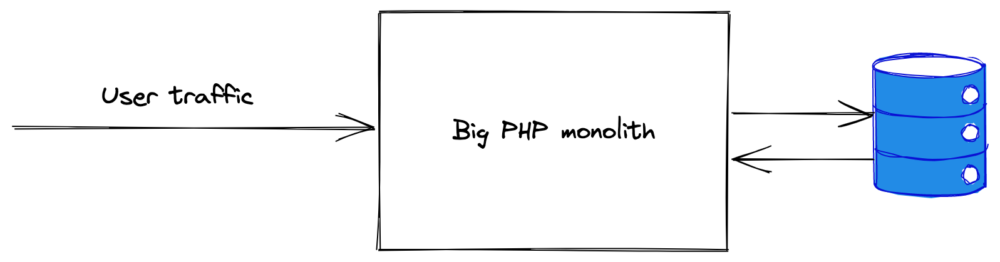
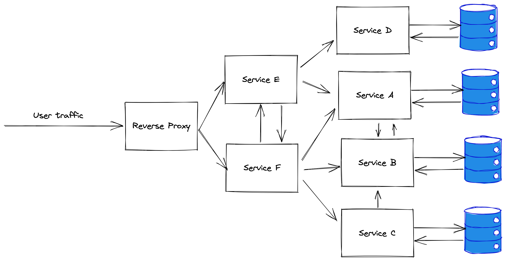

% NoMicroServices
% Tomas Urbonaitis
% 2022-07-25

## About me
* 15+ years in the industry
* Mostly dotnet (but not anymore)
* Mostly backend distributed systems
* Microservices since 2012

## TLDR
* Are they bad? 
* Should I do them or not? 
* `NoMicroservices` like `NoSql`

## What are microservices? 
According to wikipedia:

> A microservice architecture – a variant of the SOA (service-oriented architecture) structural style – arranges an application as a collection of loosely-coupled services. In a microservices architecture, services are fine-grained and the protocols are lightweight.

## Monolith architecture

## Microservice Architecture

## The lure
* Trendy! Cool!
* Uber/Google/Facebook and erveryone else does microservices!

## The advantages
* Fleixibility in technology/language choice
* Clear, explicit boundaries between components
* Small deployable units (scalability, fault tollerance)

## The Dark Side
* Complex system topology
* (highly) distributed system debugging
* More complex operations story
* Defining the service boundaries correctly is hard

## The Dark Side (vol 2)
* Local development is more complicated
* Testing is more complicated
* Much harder to refactor code
* Dependency management

## The Dark Side (vol 3)
* Less tooling maturity
* More IPC == decreased performance
* You get a whole new set of problems that monoliths just don't have to solve:
    * service discovery
    * versioning
    * inter service authN and authZ

## What to do?
* Start with a well structured monolith
* Carve out separate services when:
    * Domain is well understood
    * You have people who have the expertise needed to develop and run microservices
    * You are ready to invest in devops and tooling
    * You have the need to scale the components individually
    * You need to use different technologies/languages
* Some areas can be deployed as separate service from the very start (i.e. authentication)

## In summary
* Any engineering solution is a compromise
* Choosing the correct solution has to take into account the context (and not just the technical context)
* It'll probably get worse before it gets better

## Thank you! 
