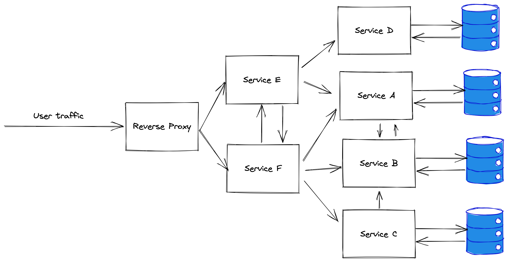
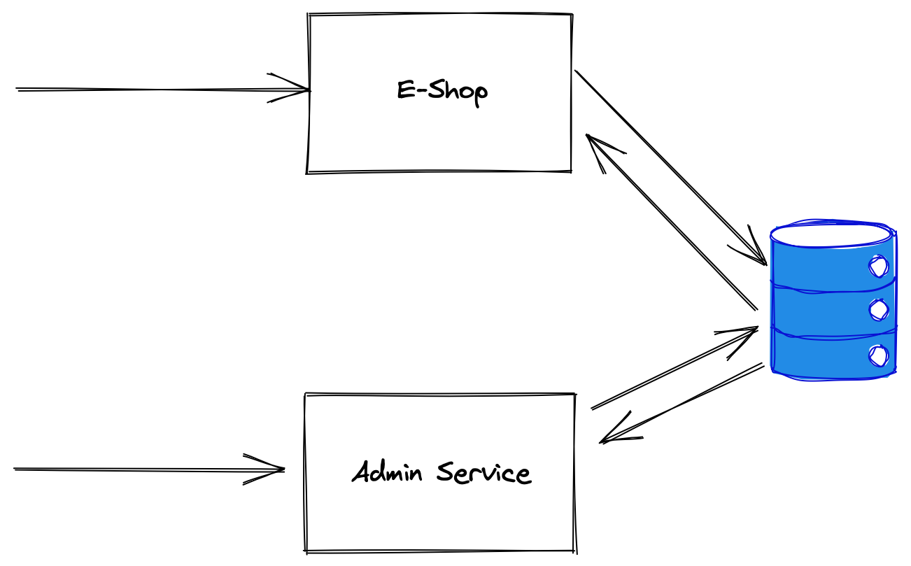

% NoMicroServices
% Tomas Urbonaitis
% 2022-07-25

## DISCLAIMER
All the content in this presentation is my own and does not represent the positions of my employers, past or present.

## About me
* 15+ years in the industry
* Mostly dotnet (but not anymore :( )
* Mostly backend distributed systems
* Microservices since 2012

::: notes

Started using microservices when they're still being called SOA.

Split monolith to microservices.

Created microservice-based green field solution. 

Worked in single language microservice systems and in multi-language microservice systems.

Worked in development roles and in more operational roles.

Worked in small startups that were doing microservices and in big companies that do microservices.

Still don't know everything. Or anthing :)

:::

## TLDR
* `NoMicroservices` like `NoSql`
* Are they bad? 
* Should I do them or not? 

::: notes

If you hope to hear some conclusive arguments against microservices - this is the wrong presentation.

NoMicroservices is like NoSQL - "Not only microservices". 

Are they always bad? Definitely not. Some companies can only succeed with microservices.

The real question is should you use them or not. And the answer is.... it depends :)

The goal is to discuss some of the tradeoffs and what one should have in mind especially with scaled microservices.

:::

## What are microservices? 
According to wikipedia:

> A microservice architecture – a variant of the SOA (service-oriented architecture) structural style – arranges an application as a collection of loosely-coupled services. In a microservices architecture, services are fine-grained and the protocols are lightweight.

::: notes

Who works on monoliths? 

Who works on microservices?

How many services does your system have?
- <10?
- 10-50?
- 50-100? 
- 100-1000? 
- 1000+?
- God knows? 

Languages:
- Single language? 
- Multiple languages?

:::

## Exhibit 1

::: notes
So, as some people are already familiar with microservices, this will be easy :) 

Who here thinks this is microservices?

Not all the complexity captured here
- What fronts laod balanced microservices?
- How are they discovered?
- Local vs regional vs global
:::

## Exhibit 2

::: notes
One could argue, but in general this is a microservice antipattern. 

There's no defined contract if you integrate via DB.

If anyone has successfully scaled such a solution - please talk to me after the presentation.
:::

## Exhibit 3

::: notes
There's no trick here - it's just an old monolith
:::

## The lure
* Trendy! Cool!
* FAANG and everyone else does microservices!
* Solves some actual issues

::: notes
So why do people chose to use microservices in the first place?

I was one of them! Let me tell you a story. I just left my previous job and was invited by a few ex-colleagues to join their greenfield startup. They've just raised seed capital for their idea and we now had to create a working product in half a year. We knew the market opportunity was there and were expecting immediate exponential growth. We were really familiar with microservices - the previous company we all worked at used them very successfully. Given the above, we decided to create a microservice based system from the beginning. Was that the right decision?

NO!

I'd say a lot of people do this because they're trendy and because FAANG companies use them (well, to be clear, no one knows what apple does, as they're so secretive :) ) 

i'm not saying it's everyone - some people are actually adressing some genuine needs by using microservices.
:::

## The advantages
* Flexibility in technology/language choice
* Clear, explicit boundaries between components
* Small deployable units (scalability, fault tolerance)
* Enables large change volumes (organisational scalability)

## The Dark Side
* Complex system topology
* (highly) distributed system debugging
* More complex operations story
* Local development is more complicated

## The Dark Side (vol 2)
* Testing is more complicated
* Much harder to refactor code
* Dependency management
* Less tooling maturity

## The Dark Side (vol 3)
* More IPC == decreased performance
* You get a whole new set of problems that monoliths just don't have to solve:
    * service discovery
    * versioning
    * inter service authN and authZ
* all the above get harder with scale (product, organisational)

## What to do?
* Start with a well structured monolith
* Carve out separate services when:
    * Domain is well understood
    * You have people who have the expertise needed to develop and operate microservices
    * You are ready to invest in devops and tooling
    * You will benefit from the advantages
* Some areas can be deployed as separate service from the very start (i.e. authentication)

## In summary
* Any engineering solution is a compromise
* Choosing the correct solution has to take into account the context (and not just the technical context)
* It'll probably get worse before it gets better

## Thank you! 
https://urbonaitis.lt

http://linkedin.com/in/tomasurbonaitis/

https://github.com/turbonaitis
